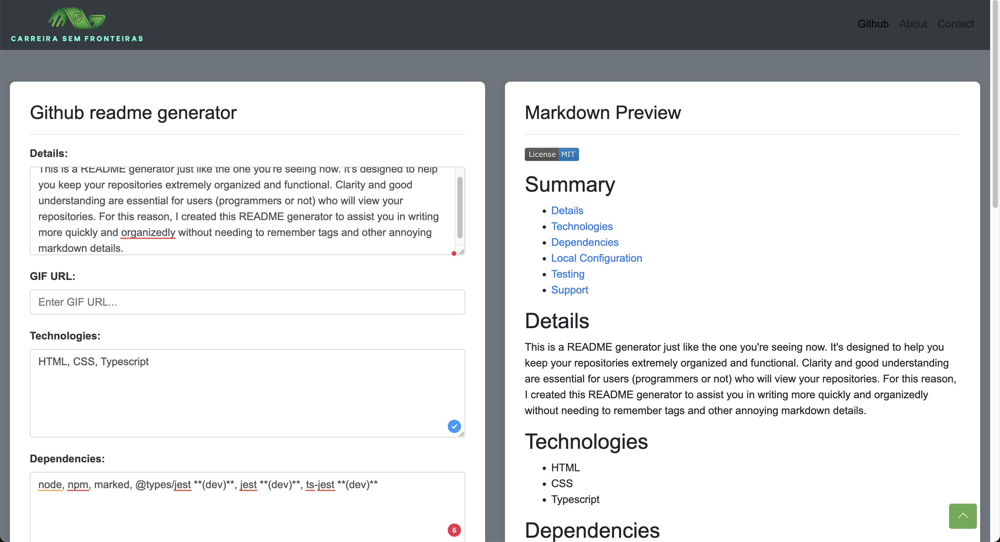

## Summary

- [Details](#details)
- [Technologies](#technologies)
- [Dependencies](#dependencies)
- [Local Configuration](#local-configuration)
- [Testing](#testing)
- [Support](#support)
## Details
This is a README generator just like the one you're seeing now. It's designed to help you keep your repositories extremely organized and functional. Clarity and good understanding are essential for users (programmers or not) who will view your repositories. For this reason, I created this README generator to assist you in writing more quickly and organizedly without needing to remember tags and other annoying markdown details.



## Technologies
- HTML
- CSS
- Typescript

## Dependencies
- node
- npm
- marked
- @types/jest **(dev)**
- jest **(dev)**
- ts-jest **(dev)**

## Local Configuration
First of all, clone it to your machine. After that, navigate using your command line (terminal, bash, shell...) until the cloned repo root folder and run:


```bash
npm i
```

After the installation, you can launch (building) the application in real time using the following command:


```bash
npm run start
```

Or, if you want only build your changes:

```bash
npm run build
```

## Testing
To run unitary tests, by default we are using jest.


```bash
npm run test
```

## Support
If you have any queries or doubts, please, feel free to contact me by e-mail. For bugs or similar, feel free to open a pull request or issue.

Please, if you want so submit a PR fist of all update the unitary tests considering your changes. Help me to keep de repo organized ;).

